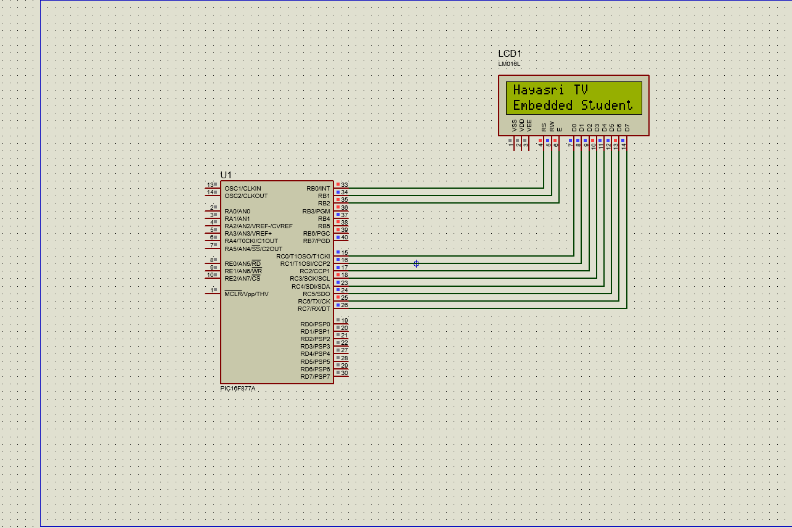

# PIC16F877A - 16x2 LCD Display Interface

Interfacing a 16x2 character LCD (HD44780-compatible) with the PIC16F877A in 8-bit mode, written in C using the HI-TECH C compiler. Displays two custom text strings on the LCD.

## Output

## How It Works

| Function | Purpose |
|---|---|
| `lcd_cmd(x)` | Sends a command byte to the LCD (e.g. clear screen, cursor position, display mode) — RS=0 tells the LCD "this is a command, not data" |
| `lcd_dat(y)` | Sends a data byte (a character) to be displayed — RS=1 tells the LCD "this is data to print" |
| `lcd_init()` | Initializes the LCD: sets 8-bit/2-line mode, turns the display and cursor on, sets auto-increment entry mode, clears the screen |
| `lcd_show(str)` | Walks through a string character by character and sends each one via `lcd_dat()` until it hits the null terminator |
| `RS`, `RW`, `EN` | Control pins mapped to individual PORTB pins (RB0, RB1, RB2) — each must be a separate pin, not the whole port |

### Control Pin Signals

- **RS (Register Select):** 0 = command, 1 = data
- **RW (Read/Write):** 0 = write (we only write in this code)
- **EN (Enable):** a HIGH-to-LOW pulse latches the data/command into the LCD

## Common Mistakes to Avoid

- **Don't map RS/RW/EN to the same port** (`#define RS PORTB`) — each needs its own dedicated pin, otherwise setting one overwrites the others
- **Don't assign a string directly to a port macro** (`lcd_data = "text";`) — always call `lcd_show("text");`, a proper function that loops through and sends each character
- **Declare function prototypes** before `lcd_init()` if `lcd_cmd()`/`lcd_dat()` are defined later in the file, otherwise the compiler won't recognize the calls
- Use `lcd_cmd(0xC0)` to move to line 2 — reusing `0x80` (line 1) for both strings makes them overlap

## Hardware Setup (Proteus / Real Circuit)

- **Data pins (D0-D7):** connect to PORTC (RC0-RC7)
- **RS, RW, EN:** connect to RB0, RB1, RB2
- **VSS** → GND, **VDD** → +5V, **V0** → contrast (via potentiometer, ~10k)
- **A, K** (backlight) → +5V and GND through a current-limiting resistor if needed

## Possible Improvements

- Add a `lcd_gotoxy(row, col)` helper function to move the cursor to any position
- Switch to 4-bit mode to save I/O pins (uses only 4 data lines instead of 8)
- Replace the busy-wait `delay()` with checking the LCD's busy flag for faster, more reliable timing

## Tools Used

- **IDE:** MPLAB IDE v8.63
- **Compiler:** HI-TECH C for PIC10/12/16
- **MCU:** PIC16F877A
- **Display:** 16x2 character LCD (HD44780-compatible)
